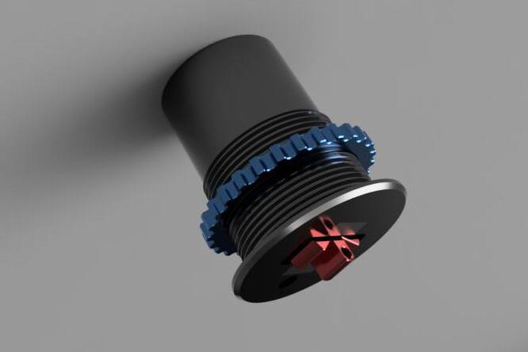

# RC-Boat-Speed-Log

 ⚠️**ВДАННЫЙ МОМЕНТ ПРОЭКТ В ПРОЦЕЕСЕ СОЗДАНИЯ**⚠️\
 ⚠️**AT THE MOMENT, THE PROJECT IS IN THE PROCESS OF BEING CREATED**⚠️

Проект создания лага, для измерения скорсти модели(RC) относительно воды(STW).\
Project for creating a log for measuring speed trought water (STW).

## Компоненты\Component:

 - Ардуино\Arduino                      
 - Резистор 10K \ Resistance 10K                   
 - Датчик Холла \ Hall sensor 

## Схема подключения \ Circuit diagram 

## Корпус \ Housing 

